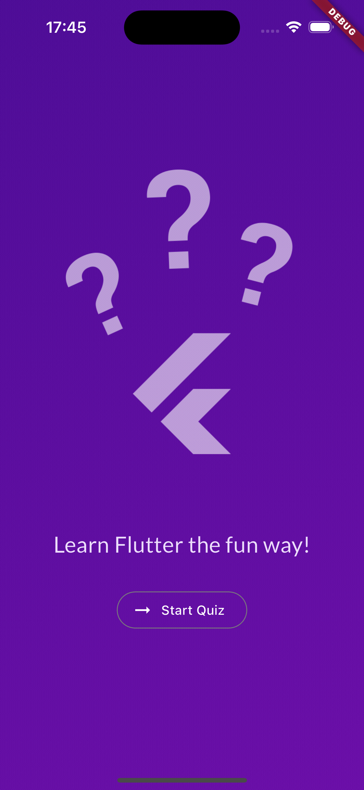
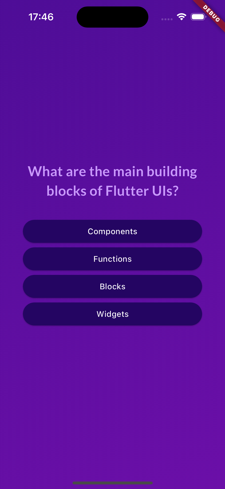
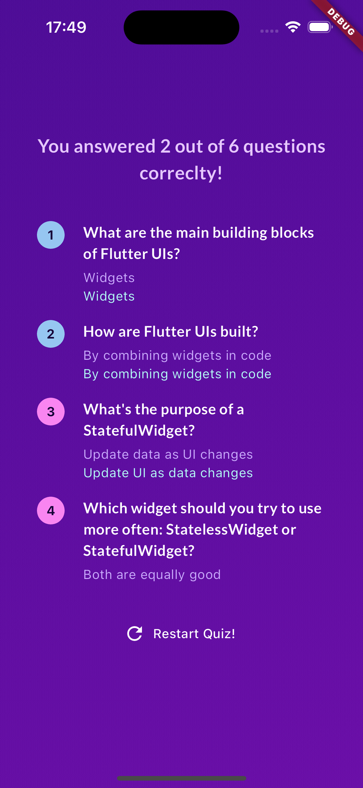
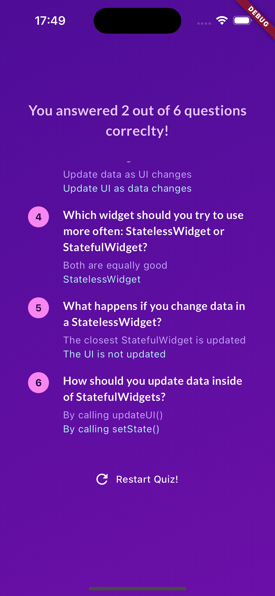

# adv_basics
- クイズアプリ

## 画面

StartScreen | QuestionScreen
--- | ---
 | 
StartQuiz タップでQuestionScreenに遷移する | 選択肢をタップすることで次の設問へ遷移する

ResultScreen(1/2) | ResultScreen(2/2)
--- | ---
 | 
結果が表示される 設問番号の正解:水色、不正解:ピンクで出し分け | 結果部分はスクロール可能 Restart Quiz! タップでQuestionScreenに遷移する